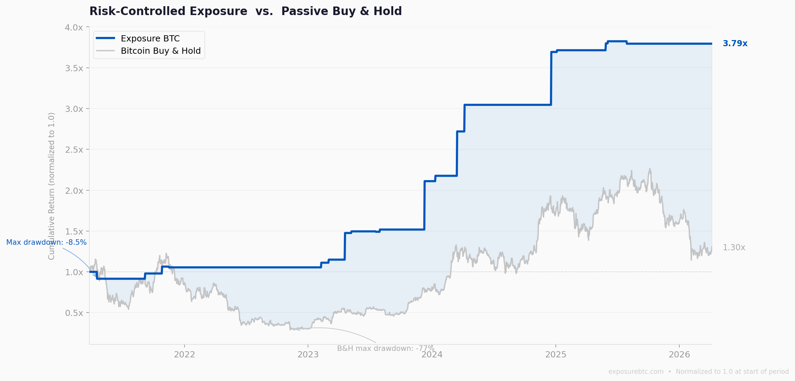

# Exposure BTC — Public Methodology

**Quantitative Bitcoin exposure framework focused on regime detection, drawdown control, and risk-aware market participation.**

It is not a price prediction system. It is not a trading bot.

It is a framework for evaluating whether Bitcoin market conditions are structurally favorable or increasingly fragile — and adjusting exposure accordingly.

---

## Performance overview

**Backtest period: March 2021 – April 2026 (5 years)**

| | Exposure BTC | Bitcoin Buy & Hold |
|---|---|---|
| Cumulative return | **+279%** | +30% |
| Maximum drawdown | **−8.5%** | −76.6% |
| Approach | Regime-aware | Fully passive |

*Normalized to 1.0 at start of period. Past performance does not guarantee future results.*

The strategy outperforms on both dimensions because avoiding deep drawdowns preserves compounding capital. A position that avoids a 76% crash recovers from a much higher base — that is the core mechanical advantage of drawdown control, not curve-fitting.

---

## What this is

Most Bitcoin investors stay fully exposed regardless of market conditions.

Exposure BTC is built on a different premise:

> Market conditions change, and exposure should adapt accordingly.

The framework continuously evaluates whether the environment is structurally favorable or increasingly fragile — and adjusts participation accordingly.

It classifies conditions into three broad regimes:

- **Favorable** — environment supports disciplined exposure
- **Neutral** — mixed or transitioning conditions
- **High risk** — structural deterioration detected, exposure quality reduced

---

## What it is not

- Not a trading signal feed
- Not a short-term prediction tool
- Not based on price targets or narratives
- Not a leverage or derivatives strategy
- Not a system that predicts tops or bottoms

---

## Why drawdown control matters

A 76% drawdown requires a 317% gain just to break even.

Most investors who hold through that experience either abandon the strategy or sell near the bottom. The behavioral cost of deep drawdowns is often larger than the mathematical one.

Exposure BTC is designed to reduce time spent in those environments — not to be right every day, but to avoid structural damage to the compounding base.

---

## Public documentation

- Full methodology: [`methodology.md`](methodology.md)
- Evaluation framework and metrics: [`metrics.md`](metrics.md)
- Common questions: [`faq.md`](faq.md)

---

## Important note

This repository contains a conceptual explanation only.

The internal model — including signal construction, weighting, thresholds, and decision logic — remains private. This repository exists to explain the framework and provide transparency around how market conditions are evaluated at a conceptual level.

---

## Product

Active signals and full framework access: **[exposurebtc.com](https://exposurebtc.com)**
